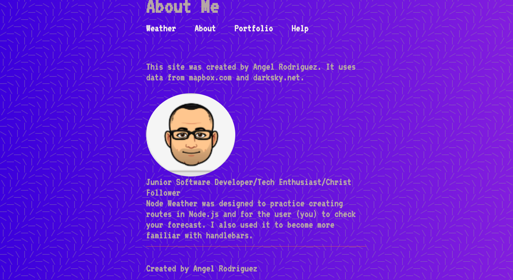

# node-js-weather
Node.js weather app.
The app also uses handlebars. I used this to practice creating routes and have several APIs work together inside of Node. 

I added skycons to the app for effect. This adds a bit of animation and life to the weather home page as well. 

Credit to UI designer and illustrator Steve Schoger from heropatterns.com for the layered svg and UI Gradients for the gradient background. I blended them both together.

1. If you'd like to run the app locally, clone or download it first. 
2. Once the app is cloned, from the terminal, make sure you're in the root folder and type in "npm run dev" or "npm run start" without the quotes.
3. Voila! You're up and running!

